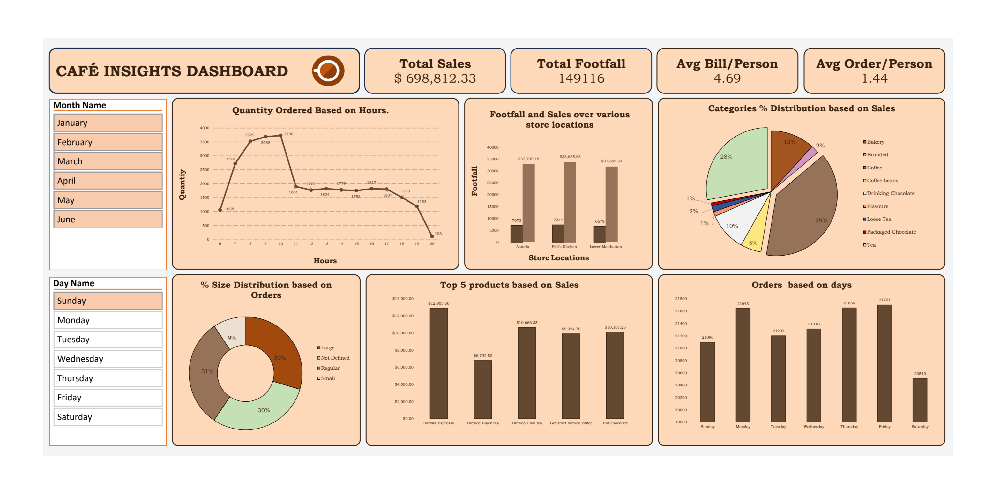
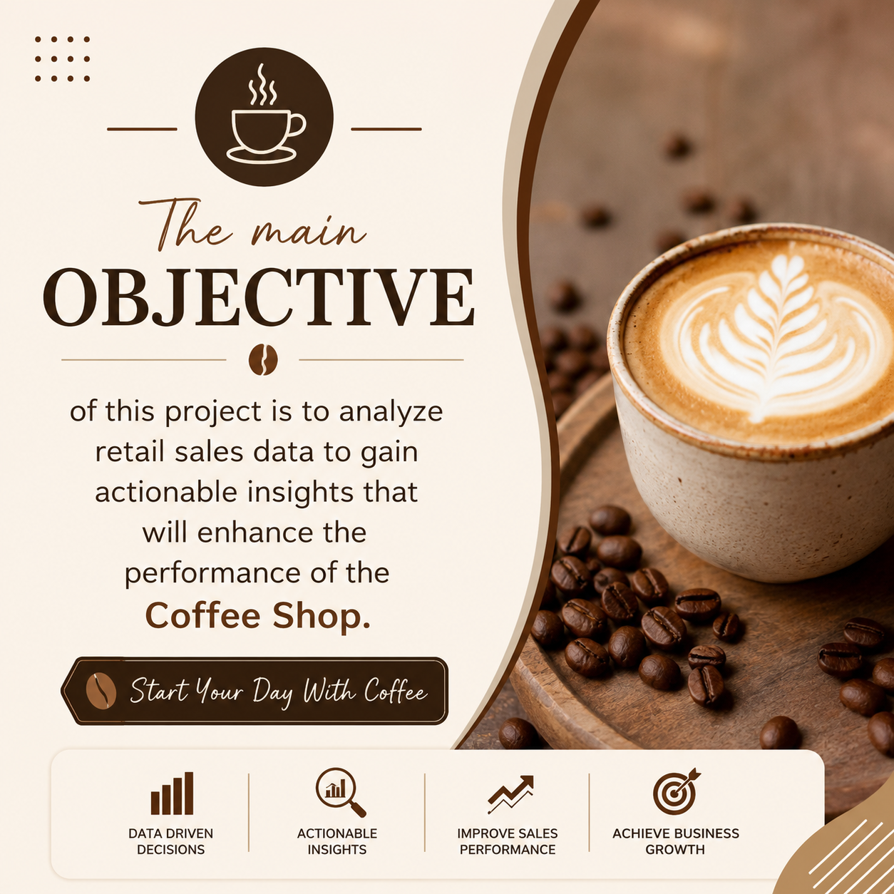
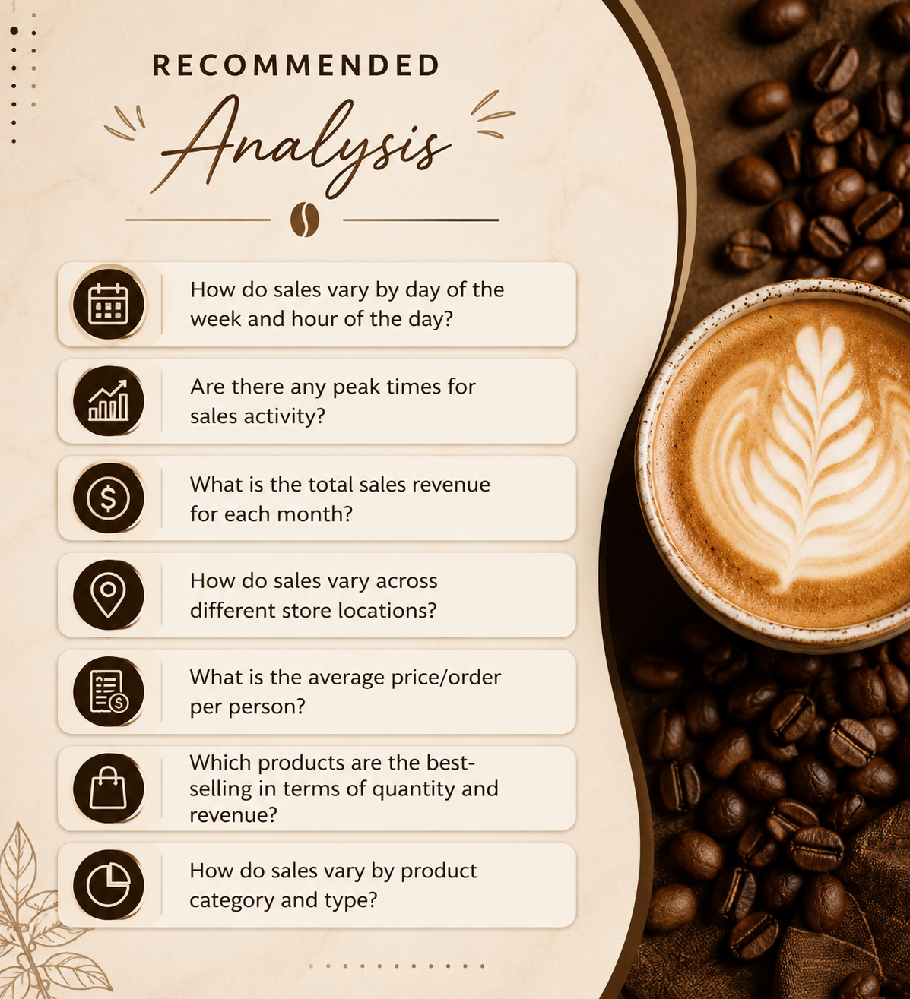

<h1 align="center">☕ 𝐂𝐚𝐟é 𝐈𝐧𝐬𝐢𝐠𝐡𝐭𝐬 𝐃𝐚𝐬𝐡𝐛𝐨𝐚𝐫𝐝</h1>

<p align="center">
Retail Sales Analysis using Microsoft Excel
</p>

<p align="center">
An interactive Excel dashboard project built to analyze coffee shop retail sales data and uncover actionable business insights.
</p>

---

## 📌 𝐏𝐫𝐨𝐣𝐞𝐜𝐭 𝐎𝐯𝐞𝐫𝐯𝐢𝐞𝐰

The main objective of this project is to analyze retail sales data to gain actionable insights that can improve the performance of a coffee shop business.

This dashboard helps identify:

- 📈 Sales trends by **day and hour**
- ⏰ Peak sales periods
- 💰 Monthly revenue patterns
- 🏪 Store-wise performance comparison
- ☕ Best-selling products
- 📊 Category-wise sales distribution
- 🛒 Customer purchasing behavior

---

## 🎯 𝐁𝐮𝐬𝐢𝐧𝐞𝐬𝐬 𝐐𝐮𝐞𝐬𝐭𝐢𝐨𝐧𝐬 𝐒𝐨𝐥𝐯𝐞𝐝

This analysis answers the following business questions:

1. How do sales vary by **day of the week** and **hour of the day**?
2. Are there any **peak times** for sales activity?
3. What is the **total sales revenue** for each month?
4. How do sales vary across **different store locations**?
5. What is the **average order per customer**?
6. Which products are the **best-selling** in terms of quantity and revenue?
7. How do sales vary by **product category and type**?

---

## 🛠️ 𝐓𝐨𝐨𝐥𝐬 & 𝐒𝐤𝐢𝐥𝐥𝐬 𝐔𝐬𝐞𝐝

- **Microsoft Excel**
- **Pivot Tables**
- **Pivot Charts**
- **Slicers**
- **Data Cleaning**
- **Data Analysis**
- **Dashboard Design**
- **Business Insights**

---

## 📊 𝐃𝐚𝐬𝐡𝐛𝐨𝐚𝐫𝐝 𝐏𝐫𝐞𝐯𝐢𝐞𝐰

### ☕ Main Dashboard

<p align="center">
  
</p>

---

### 🎯 Project Objective

<p align="center">
  
</p>

---

### 📌 Recommended Analysis

<p align="center">
  
</p>

---

## 📈 𝐊𝐞𝐲 𝐈𝐧𝐬𝐢𝐠𝐡𝐭𝐬

- Sales show noticeable variations across different hours and weekdays.
- Morning hours generated higher sales activity.
- Certain product categories contributed more to total revenue.
- Store locations performed differently in terms of revenue.
- Customer purchasing patterns revealed high-performing products.

---

## 📂 𝐑𝐞𝐩𝐨𝐬𝐢𝐭𝐨𝐫𝐲 𝐒𝐭𝐫𝐮𝐜𝐭𝐮𝐫𝐞

```txt
cafe-insights-dashboard/
│── assets/
│   ├── dashboard.png
│   ├── objective.png
│   └── recommended_analysis.png
│
│── dataset/
│   └── coffee_shop_sales.csv
│
│── Coffee_Shop_Sales_Dashboard.xlsx
│── README.md
```

---

## 🚀 𝐇𝐨𝐰 𝐭𝐨 𝐔𝐬𝐞

1. Download the Excel dashboard file.
2. Open it in **Microsoft Excel**.
3. Navigate to the dashboard sheet.
4. Use slicers to interact with the data.
5. Explore insights across months and store locations.

---

## 👨‍💻 𝐀𝐮𝐭𝐡𝐨𝐫

### **Aakash Vishwakarma**
Aspiring **Data Analyst** passionate about transforming raw data into meaningful insights.

### 🔗 Connect With Me

- GitHub: *(Add your GitHub profile link)*
- LinkedIn: *(Add your LinkedIn profile link)*

---

⭐ If you found this project useful, consider giving it a **star**!
